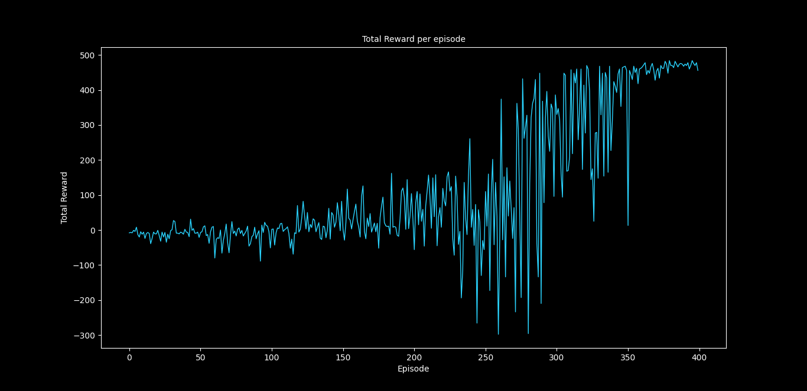
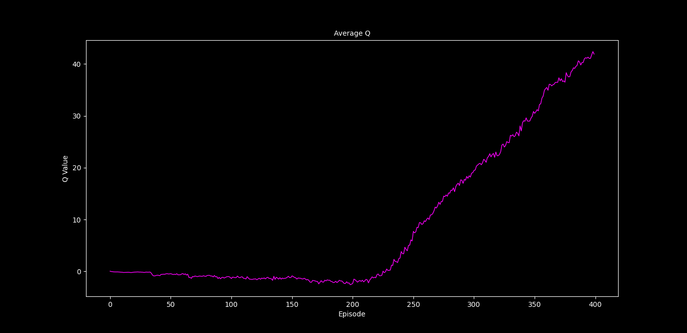
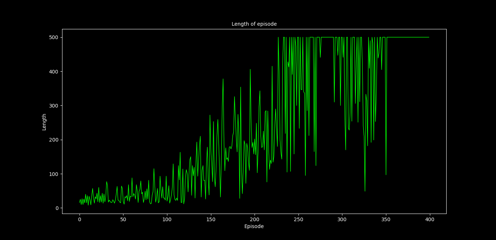
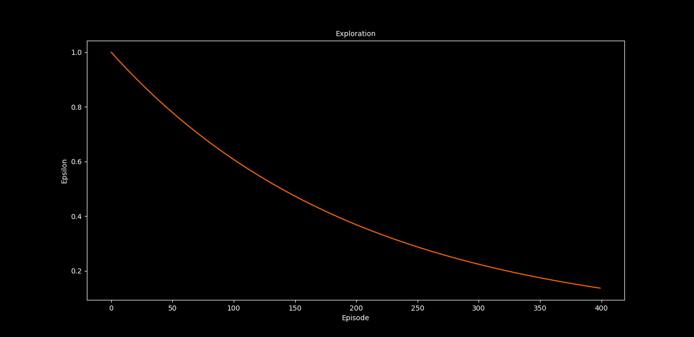

# 🎮 Deep Q-Learning — CartPole & Mountain Car

> **Teaching AI agents to balance poles and climb mountains — one episode at a time!**

This project implements **Deep Q-Learning (DQN)** to solve two classic reinforcement learning problems from OpenAI Gym:

| 🕹️ Problem | 🎯 Goal | 📊 Episodes |
|---|---|---|
| **CartPole-v1** | Balance a pole on a moving cart | 400 |

---
### Key Ideas Used Here

- **🔁 Experience Replay** — The agent stores past experiences *(state, action, reward, next_state)* in a **replay buffer** and learns from random mini-batches. This breaks correlation between consecutive samples and stabilizes training.

- **🎯 Target Network** — A separate copy of the Q-network that is updated less frequently. This prevents the "moving target" problem where the network chases its own changing predictions.

- **🎲 Epsilon-Greedy Exploration** — The agent starts by exploring randomly (high ε) and gradually shifts to exploiting its learned knowledge (low ε). Epsilon decays after every episode.

- **📉 Huber Loss** — A robust loss function that combines the best of MSE (for small errors) and MAE (for large errors), making training more stable.

---

## 📂 Project Structure

```
📦 cart_poling/
├── 🐍 dqn_cartpole.py          # DQN training script for CartPole-v1
├── 📄 requirements.txt         # Python dependencies
├── 📊 metric.csv               # Training metrics for CartPole
├── 🧠 dqn_q_net/               # Saved CartPole trained model (TensorFlow SavedModel)
├── 📈 cartpole_figures/         # Training result plots for CartPole
```

---

## 🏗️ How It Works

### 1. CartPole (`dqn_cartpole.py`)

The agent controls a cart that can move **left** or **right**. A pole is attached to the cart by a hinge, and the goal is to keep the pole balanced upright.

- **State Space** — 4 values: cart position, cart velocity, pole angle, pole angular velocity
- **Action Space** — 2 actions: push left, push right
- **Network Architecture** — `Input(4) → Dense(32, ReLU) → Dense(16, ReLU) → Dense(2, Linear)`
- **Custom Reward** — Instead of the default gym reward, a custom reward function encourages the agent to keep the cart centered, the velocity low, the pole upright, and angular velocity minimal

### 2. Plotter (`plotter.py`)

A live plotting tool that reads `metric.csv` every 10 seconds and displays four real-time graphs:

| Plot | What It Shows |
|---|---|
| 📈 **Total Reward per Episode** | How much reward the agent earns over time |
| 📈 **Average Q-Value** | The agent's confidence in its decisions |
| 📈 **Episode Length** | Number of steps per episode (shorter is better for Mountain Car) |
| 📈 **Exploration (Epsilon)** | How much the agent is exploring vs exploiting |

---

## 📈 Training Results

### CartPole-v1

<p align="center">
  
  
</p>
<p align="center">
  
  
</p>

## 🛠️ Tech Stack

- **[TensorFlow / Keras](https://www.tensorflow.org/)** — Neural network framework
- **[OpenAI Gym](https://www.gymlibrary.dev/)** — Reinforcement learning environments
- **[Matplotlib](https://matplotlib.org/)** — Real-time training visualizations
- **[Pandas](https://pandas.pydata.org/)** — Metric logging and CSV handling
- **[OpenCV](https://opencv.org/)** — Rendering the trained agent

---
