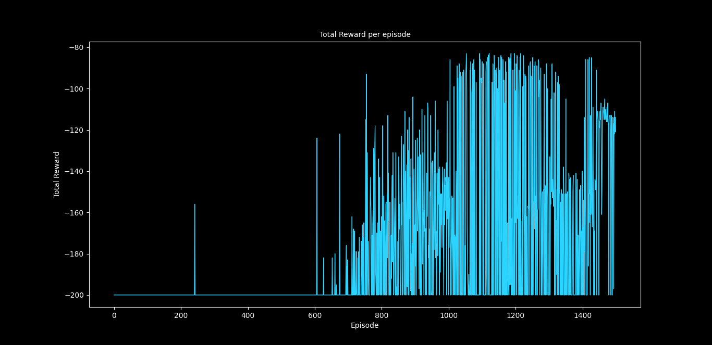
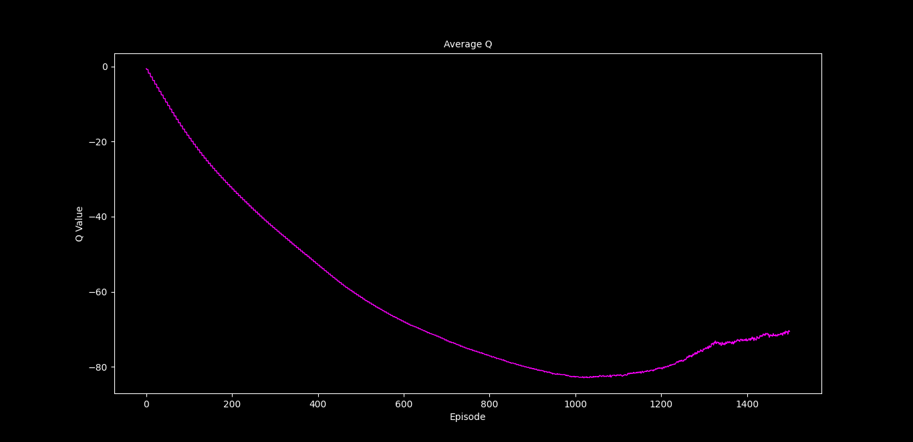
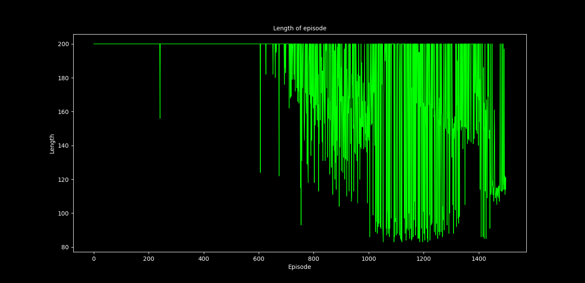
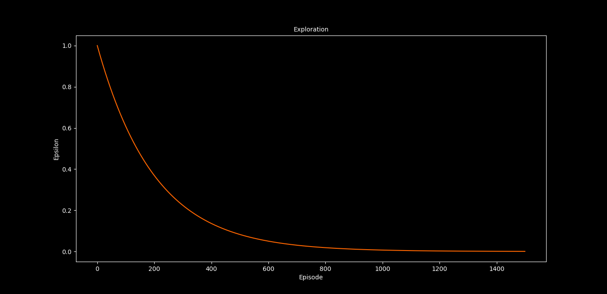

# 🎮 Deep Q-Learning — CartPole & Mountain Car

> **Teaching AI agents to balance poles and climb mountains — one episode at a time!**

This project implements **Deep Q-Learning (DQN)** to solve two classic reinforcement learning problems from OpenAI Gym:

| 🕹️ Problem | 🎯 Goal | 📊 Episodes |
|---|---|---|
| **CartPole-v1** | Balance a pole on a moving cart | 400 |
| **MountainCar-v0** | Drive an underpowered car up a steep hill | 1500 |

---

## 🧠 What Is Deep Q-Learning?

Traditional Q-Learning stores a table of values for every state-action pair — but that breaks down when the state space is continuous (like positions and velocities). **Deep Q-Learning** replaces that table with a **neural network** that learns to predict the best action for any given state.

### Key Ideas Used Here

- **🔁 Experience Replay** — The agent stores past experiences *(state, action, reward, next_state)* in a **replay buffer** and learns from random mini-batches. This breaks correlation between consecutive samples and stabilizes training.

- **🎯 Target Network** — A separate copy of the Q-network that is updated less frequently. This prevents the "moving target" problem where the network chases its own changing predictions.

- **🎲 Epsilon-Greedy Exploration** — The agent starts by exploring randomly (high ε) and gradually shifts to exploiting its learned knowledge (low ε). Epsilon decays after every episode.

- **📉 Huber Loss** — A robust loss function that combines the best of MSE (for small errors) and MAE (for large errors), making training more stable.

---

## 📂 Project Structure

```
📦 cart_poling/
├── 🐍 dqn_cartpole.py          # DQN training script for CartPole-v1
├── 🐍 dqn_mountain_car.py      # DQN training script for MountainCar-v0
├── 🐍 evaluator.py             # Loads trained model & renders the agent playing
├── 🐍 plotter.py               # Live training metric plots (updates every 10s)
├── 📄 requirements.txt         # Python dependencies
├── 📊 metric.csv               # Training metrics for CartPole
├── 📊 mountain_metric.csv      # Training metrics for Mountain Car
├── 🧠 dqn_q_net/               # Saved CartPole trained model (TensorFlow SavedModel)
├── 🧠 dqn_mountain_q_net/      # Saved Mountain Car trained model (TensorFlow SavedModel)
├── 📈 cartpole_figures/         # Training result plots for CartPole
└── 📈 mountain_car_figures/     # Training result plots for Mountain Car
```

---

## 🏗️ How It Works

### 1. CartPole (`dqn_cartpole.py`)

The agent controls a cart that can move **left** or **right**. A pole is attached to the cart by a hinge, and the goal is to keep the pole balanced upright.

- **State Space** — 4 values: cart position, cart velocity, pole angle, pole angular velocity
- **Action Space** — 2 actions: push left, push right
- **Network Architecture** — `Input(4) → Dense(32, ReLU) → Dense(16, ReLU) → Dense(2, Linear)`
- **Custom Reward** — Instead of the default gym reward, a custom reward function encourages the agent to keep the cart centered, the velocity low, the pole upright, and angular velocity minimal

### 2. Mountain Car (`dqn_mountain_car.py`)

An underpowered car sits in a valley between two hills. The engine isn't strong enough to drive straight up, so the agent must learn to **build momentum** by rocking back and forth.

- **State Space** — 2 values: car position, car velocity
- **Action Space** — 3 actions: push left, no push, push right
- **Network Architecture** — `Input(2) → Dense(64, ReLU) → Dense(32, ReLU) → Dense(3, Linear)`
- **Reward** — Uses the default environment reward (−1 per step until the car reaches the goal)

### 3. Evaluator (`evaluator.py`)

Loads a pre-trained model and renders the agent in action using OpenCV. Watch the trained agent solve the Mountain Car problem in real-time!

### 4. Plotter (`plotter.py`)

A live plotting tool that reads `metric.csv` every 10 seconds and displays four real-time graphs:

| Plot | What It Shows |
|---|---|
| 📈 **Total Reward per Episode** | How much reward the agent earns over time |
| 📈 **Average Q-Value** | The agent's confidence in its decisions |
| 📈 **Episode Length** | Number of steps per episode (shorter is better for Mountain Car) |
| 📈 **Exploration (Epsilon)** | How much the agent is exploring vs exploiting |

---

## 🔧 Hyperparameters

| Parameter | CartPole | Mountain Car |
|---|---|---|
| Epsilon (start) | 1.0 | 1.0 |
| Epsilon Decay | 1.005 | 1.005 |
| Discount (γ) | 0.99 | 0.99 |
| Replay Buffer Size | 100,000 | 100,000 |
| Batch Size | 64 | 64 |
| Target Update Freq | Every 4 steps | Every 1000 steps |
| Learn Every | 3 steps | 3 steps |
| Episodes | 400 | 1500 |

---

## 📈 Training Results

### CartPole-v1

<p align="center">
  
  
</p>
<p align="center">
  
  
</p>

### MountainCar-v0

<p align="center">
  
  
</p>
<p align="center">
  
  
</p>

---

## 🚀 Getting Started

### Prerequisites

- Python 3.8+
- pip

### Installation

```bash
# Clone the repository
git clone https://github.com/samarthgour2005/cart_poling.git
cd cart_poling

# Install dependencies
pip install -r requirements.txt
```

### Train the Agents

```bash
# Train CartPole agent (400 episodes)
python dqn_cartpole.py

# Train Mountain Car agent (1500 episodes)
python dqn_mountain_car.py
```

### Watch the Trained Agent

```bash
# See the Mountain Car agent in action
python evaluator.py
```

### Monitor Training (Live Plots)

```bash
# Run alongside training to see live metrics
python plotter.py
```

---

## 🛠️ Tech Stack

- **[TensorFlow / Keras](https://www.tensorflow.org/)** — Neural network framework
- **[OpenAI Gym](https://www.gymlibrary.dev/)** — Reinforcement learning environments
- **[Matplotlib](https://matplotlib.org/)** — Real-time training visualizations
- **[Pandas](https://pandas.pydata.org/)** — Metric logging and CSV handling
- **[OpenCV](https://opencv.org/)** — Rendering the trained agent

---

## 📚 Credits

Based on the reinforcement learning series by [Raj Tilak](https://github.com/rajtilakls2510/reinforcement_learning) (Part 5 — Deep Q-Learning).

---

## 📜 License

This project is open source and available for educational purposes.
